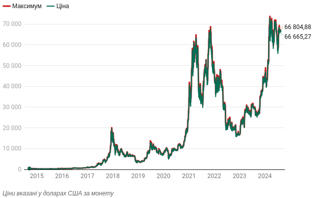
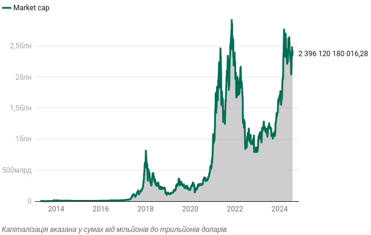
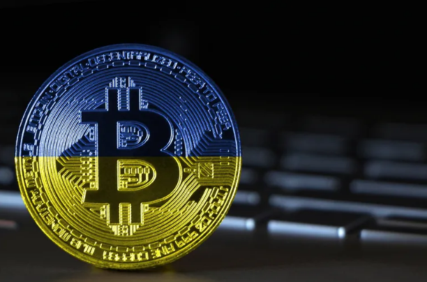

# КРИПТОВАЛЮТИ, КРИПТОВАЛЮТИ, КРИПТОВАЛЮТИ!

## ВІД НУЛЯ ДО ГЕРОЯ: НЕЙМОВІРНА ІСТОРІЯ КРИПТОВАЛЮТ У СВІТІ!

### РОЗВИТОК! ІННОВАЦІЇ! РЕВОЛЮЦІЯ!

У 2024 році абсолютно зрозуміло, що криптовалюти – це повноцінна індустрія, яка продовжує розвиватися. Все частіше лунають заяви про створення цифрових національних валют, регулювання, залучення криптовалют у різних бізнесах та сферах. Але так було далеко не завжди.

## Перші реакції світу на появу біткойна

Розглядаючи появу криптовалют в історичній ретроспективі, можна з упевненістю стверджувати, що поворотним моментом для криптоіндустрії були 2008 – 2009 роки. Саме тоді анонімна особа або група людей Сатосі Накамото опублікувала концепт біткойна та провела перші криповалютні транзакції.

Після появи біткойна буквально роками лунали заяви та припущення щодо того, чи зможе цифрова монета вижити у фінансовому світі: можливо, у протоколі виявлять недоліки, чи біткойн оголосять поза законами, або ж криптовалюта не має внутрішньої цінності, і так далі.

Ба більше, написали сотні статей, які пророкували крах по суті першої криптовалюти у світі. Але історія розвивається по-іншому: творці біткойна започаткували абсолютно нову індустрію, яка з кожним роком набирає обертів.

Основна ідея криптовалюти полягала у створенні безпечного та анонімного способу переказу грошей від однієї особи до іншої. Також у відповідь на розвиток криптотехнологій з'явилися додатки для цифрових активів, такі як NFT, Metaverse, GameFi, DeFi, Web3 тощо.

Перші роки після появи біткойн не сприймали як серйозний фінансовий актив ні серед звичайних людей, ні поміж інвесторів, банків та великих компаній. Тож цифрова монета займала незначну нішу у фінансовій екосистемі.

Це підтверджують і слова професора Алекса Преда з King’s Business School in London. Він заявляв, що на етапі розвитку електронних платіжних систем не було жодних інфоприводів, які можна було б висвітлити. А сам біткойн був маргінальним явищем, обмеженим субкультурою програмної інженерії, а не фінансовим феноменом, пише Forbes.

Тим паче ціна монети коливалася від кількох центів до кількох десятків доларів. Перше "зіткнення" криптовалюти з реальним світом відбувалося у 2010 році, коли чоловік заплатив за дві піци 10 тисяч біткойнів. Уже у 2011 році на ринку зафіксували перше, але далеко не останнє, ралі біткойна: у червні ціна монети досягла майже 30 доларів за штуку, а потім впала до 2 доларів.

Того ж року відбувалося ще кілька важливих подій для індустрії:
- Біткойн вперше досягнув паритету з доларом США;
- З’явилася перша альтернатива для біткойна – альткоїни.

### Динаміка біткойна на ринку з 2014 року

Роком пізніше Казначейство США видало інструкцію про те, що "віртуальна валюта" не є законним платіжним засобом. Тоді як у 2013 році американські сенатори провели перше в історії засідання щодо біткойна, а Віталік Бутерін повідомив про створення на сьогодні другої за популярністю криптовалюти у світі – ефіріум. Цей рік став поворотним в історії біткойна та криптоіндустрії, оскільки тоді курс монети перетнув позначку в 1000 доларів та чи не вперше привернув значну увагу масової публіки.

На той момент було зрозуміло, що обговорення щодо сектору криптовалют набирає обертів та привертає все більше уваги і зі сторони різних регуляторів, які вже не могли просто ігнорувати цю сферу, і зі сторони інвесторів, трейдерів та бізнесменів, які побачили низку нових та вигідних можливостей.

## Як змінився сектор криптовалют за трохи більше, ніж 10 років

З 2012 – 2013 року можна почати відрахунок для стрімкого розвитку криптосектору. Крім зростання популярності та цінових коливань біткойна та ефіріуму, поступово з’являються нові цифрові активи: NFT, стейблекоїни, мемкоїни тощо. Також розвивається своєрідна інфраструктура в індустрії. Йдеться про появу криптобірж, стартапів, перші спроби залучення криптовалют у бізнесах.

Змінилося і ставлення інвесторів та трейдерів до криптовалют як класу активів. Крок за кроком цифрові монети вибороли своє право бути на рівні з фіатними валютами (долар, гривня, євро), акціями публічних компаній, дорогоцінними металами тощо. Це свідчило, що ринок приваблював все більше грошей.

Для розуміння реальних масштабів зростання, крипторинок завершив 2014 рік з капіталізацією на рівні 5,5 мільярда доларів. Тоді як на сьогодні ринок криптовалют оцінюють у 2,5 трильйона доларів, згідно з даними CoinGecko. При цьому капіталізація двох найвідоміших цифрових монет – BTC та ETH – становить 1,3 трильйона доларів та понад 399 мільярдів доларів відповідно.

### Як змінювалася капіталізація крипторинку з 2024 року

Крім того, центробанки починають працювати над вивченням та створенням цифрових національних монет. Станом на травень 2024 року вже 134 країни, які складають 98% світового ВВП, працюють у цьому напрямку. Три держави вже запустили в повній мірі цифрові еквіваленти національних валют: Багами, Ямайка та Нігерія. Тоді як у Салівадорі з 2021 року біткойн є офіційним платіжним засобом. Це свідчить, що від скептицизму щодо криптовалют державні інституції перейшли до визнання.

Ще одним важливим етапом зміцнення позицій криптовалюти у глобальній фінансовій системі стало рішення про затвердження обмінних фондів ETF для біткойна та ефіріуму (хоча для другого активу у цей процес ще триває). Прогнозують, що завдяки цьому у криптосектор вдасться залучити нових інвесторів. Боротьба за схвалення від регуляторів США тривала понад 10 років.

Також у 2024 році 562 мільйони людей у світі володіють криптовалютами. Це 8,6% світового населення. Порівняно з попереднім роком цей показник зріс на 142 мільйони осіб, свідчать дані Triple-A.

> Цікава деталь! Згідно з цим же звітом Triple-A, Україна входить у топ 30 за кількістю власників криптовалюти у світі. 10,2% населення володіють цифровими монетами.

## Як почати свій шлях у криптосвіті

Процес придбання бажаної криптовалюти доволі простий. Для цього потрібно вибрати надійну платформу, яка допоможе зробити перші кроки в цій індустрії.

Для прикладу, криптобіржу WhiteBIT. Це один із найбезпечніших та найзручніших варіантів для кожного, хто починає цікавитися цифровими активами.

Для того, аби придбати криптовалюту на криптобіржі WhiteBIT, потрібно зробити всього кілька кроків:

- Реєстрація та верифікація на біржі;
- Поповнити баланс;
- > Важливо! Про усі нюанси, які потрібно знати, аби успішно завершити вищезгадані процеси, читайте за [посиланням](https://24tv.ua/economy/ctrimke-podorozhchannya-bitkoyna-yak-shvidko-zruchno-kupiti-kriptovalyuti_n2521950).
- Визначатися із криптовалютою для придбання. Криптобіржа WhiteBIT пропонує своїм користувачам 270 активів та більше ніж 520 торгових пар;
- Далі потрібно перейти до категорії "Торгівля" та обрати "Обмін", що є одним із найпростіших шляхів для придбання крипти.
- Обравши бажану монету та суму переказу, на екрані відразу висвітлиться курс та кількість монет, яку користувач отримає після завершення транзакції. - Завершити процес купівлі потрібно, натиснувши "Підтвердити".

Варто додати, що один із пріоритетів WhiteBIT – це безпека. Криптобіржа активно інвестує в посилення цього аспекту своєї платформи, оскільки до ключових цілей криптобіржі входить як захист активів клієнтів, так і постійний розвиток компанії. Відтак, обираючи WhiteBIT, можна йти у ногу з часом та відкривати для себе нові можливості у криптосвіті, знаючи, що активи будуть під надійним захистом.